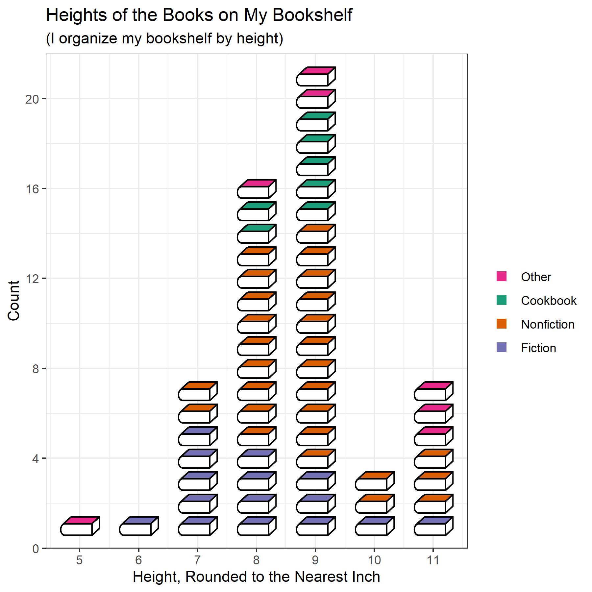
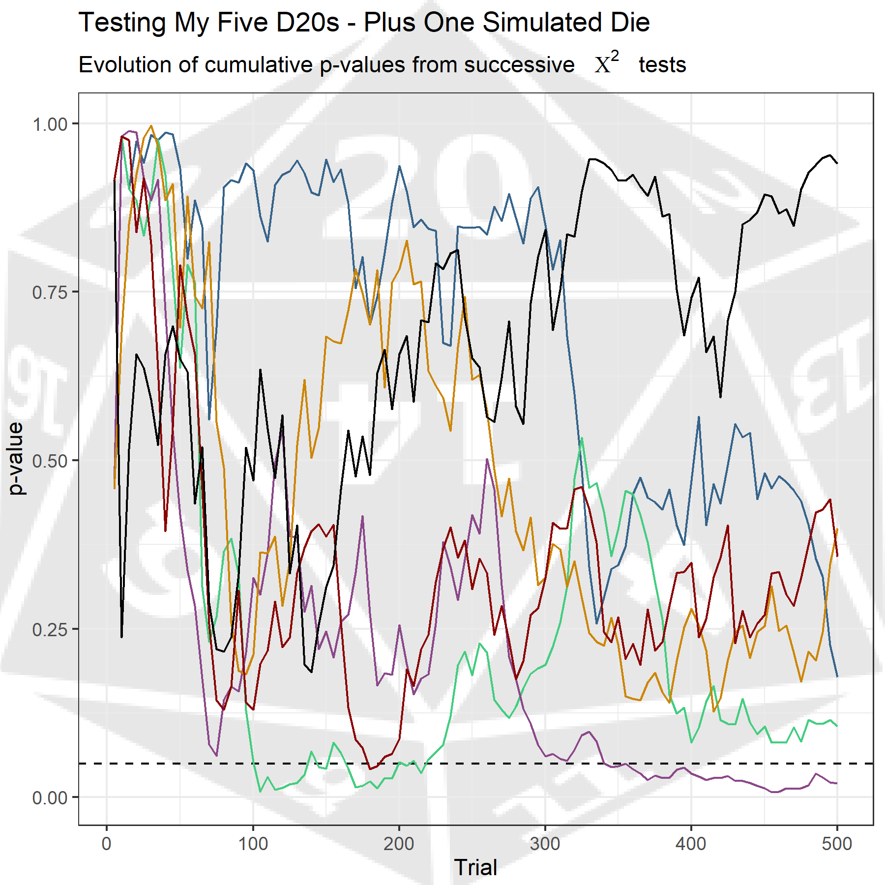

# 30DayChartChallenge

Code for my charts in the April 2021 [30 Day Chart Challenge](https://github.com/Z3tt/30DayChartChallenge_Collection2021)

## Charts

### distributions

Day 7 - physical

### comparisons

Day 6 - experimental

